# 目录

- [前言](#前言)
- [一、数码管相关考点总结](#一数码管相关考点总结)
  - [(一) 数码管控制代码](#一数码管控制代码)
  - [(二) 数码管考点分析](#二数码管考点分析)
    - [1. 显示数字](#1-显示数字)
    - [2. 显示小数点](#2-显示小数点) 
    - [3. 显示特殊字符](#3-显示特殊字符)
    - [4. 多界面](#4-多界面)
    - [5. 数码管闪烁](#5-数码管闪烁)
    - [6. 高位熄灭](#6-高位熄灭)
    - [7. 负数显示](#7-负数显示)
    - [8. 单位切换](#8-单位切换)

- [二、LED相关考点总结](#二led相关考点总结)
  - [(一) LED控制代码](#一led控制代码)
  - [(二) LED考点分析](#二led考点分析)
    - [1. 流水灯](#1-流水灯)
    - [2. PWM流水灯](#2-pwm流水灯)
    - [3. LED闪烁](#3-led闪烁以x秒为间隔闪烁指的是亮和灭的时间间隔)
    - [4. LED亮一定时间后熄灭](#4-led亮一定时间后熄灭)
    - [5. 状态指示灯](#5-状态指示灯)
    - [6. 二进制灯](#6-二进制灯)

- [三、按键考点总结](#三按键考点总结)
  - [(一) 按键底层代码](#一按键底层代码)
  - [(二) 按键触发方式](#二按键触发方式近几年-s4s5s8s9-考频很高就以这四个按键为例)
    - [1. 按下生效、松手生效](#1-按下生效松手生效)
    - [2. 短按、长按生效](#2-短按长按生效)
    - [3. 双按键](#3-双按键)
    - [4. 双击](#4-双击)
    - [5. 组合按键](#5-组合按键根据排列组合大概有二十一种组合方式一定要灵活使用)
  - [(三) 按键功能](#三按键功能)
    - [1. 状态切换](#1-状态切换)
    - [2. 参数调整](#2-参数调整)
    - [3. 多界面](#3-多界面)
    - [4. 切换选中单元](#4-切换选中单元)
    - [5. 键盘输入](#5-键盘输入)
    - [6. 按键禁用](#6-按键禁用)
    - [7. 任意按键生效](#7-任意按键生效)

- [四、蜂鸣器、继电器、电机考点总结](#四蜂鸣器继电器电机考点总结)
  - [(一) 继电器蜂鸣器电机底层代码](#一继电器蜂鸣器电机底层代码)
  - [(二) 考点分析](#二考点分析前两者考点均为状态控制电机为pwm)
    - [1. 继电器](#1-继电器)
    - [2. 蜂鸣器](#2-蜂鸣器)
    - [3. 电机](#3-电机)

- [五、采集任务考点总结](#五采集任务考点总结)
  - [(一) 采集模块总结](#一采集模块总结)
    - [1. ds18b20](#1ds18b20)
    - [2. ds1302](#2ds1302)
    - [3. NE555](#3ne555)
    - [4. PCF8591](#4pcf8591)
    - [5. 超声波](#5超声波)
    - [6. AT24C02](#6at24c02)
    - [7. 串口通信](#7串口通信)
  - [(二) 常见考点](#二常见考点)
    - [1. 采集量映射](#1采集量映射)
    - [2. DA输出](#2da输出)
    - [3. 参数比较](#3参数比较)
    - [4. 触发](#4触发)
    - [5. 数据回显](#5数据回显)
    - [6. 最值、平均值](#6最值平均值)
    - [7. 数据召测](#7数据召测)
<div style="page-break-after: always;"></div>

# 前言
本文介绍一下蓝桥杯单片机考点，以总结的角度去讲解，对底层不做过多介绍，主要着重于比赛中有所涉及的考法，对底层有疑问可以看底层讲解文章或B站UP主柳离风视频。建议看完提升篇后再着重攻读。内容摘自CSDN柳离风文章（部分更改），若有错误内容请联系助教进行修正。
<div style="page-break-after: always;"></div>

# 一、数码管相关考点总结

---
## （一）数码管控制代码 

```c
/*数码管底层驱动*/
code uchar segment[]={0x3F,0x06,0x5B,0x4F,0x66,0x6D,0x7D,0x07,0x7F,0x6F,0x00};
void smg(uchar * temp,uchar *dot,uchar pos)
{
	P0=0xff;
	hc573(7);
	P0=0x01<<pos;
	hc573(6);
	if(dot[pos]==0)
		P0=~segment[temp[pos]];   
	else
		P0=(~segment[temp[pos]]) & 0x7f;
	hc573(7);
}
```

```c
/*数码管定时器中断当时执行*/
void timer1()  interrupt 3
{
	if(++count==1000)
	{
		fre=(TH0<<8)|TL0;
		TH0=TL0=0;
		count=0;
	}
  systick_ms++;
	key_dly++;
  display_dly++;
  collect_dly++;
	smg(SMG,dot,pos);//关键部分
	led(LED,pos);
	if(++pos == 8) pos = 0;
	relay(state_relay);
}
```

```c
/*数码管主循环中幅值使用*/
SMG[0] = 10;
SMG[1] = 10;
SMG[2] = 10;
SMG[3] = 10;
SMG[4] = 10;
SMG[5] = 10;
SMG[6] = temp/10;
SMG[7] = temp%10;
```
<div style="page-break-after: always;"></div>

## （二）数码管考点分析

---
### 1. 显示数字

以 `num = 1234` 为例：
```c
SMG[4] = num / 1000;
SMG[5] = num / 100 % 10;//先除后取余
SMG[6] = num / 10 % 10;
SMG[7] = num % 10;
```

---
### 2. 显示小数点

以显示ADC采样电压，保留两位小数为例：
```c
uint adc;
/*定义unsigned int类型，保存不了小数，需要放大100倍，51.0不可以写为51！*/
adc = (PCF8591_read(0x03) / 51.0) * 100; 
SMG[5] = adc / 100 % 10;
SMG[6] = adc / 10 % 10;
SMG[7] = adc % 10;
dot[5] = 1;
```

---
### 3. 显示特殊字符

最近几年比赛会提供A-F断码，需要自己写的断码有：-、P、n、H、U、L等，以P为例： 开发板上数码管为共阳极数码管，IO口给低电平会点亮。 

<center>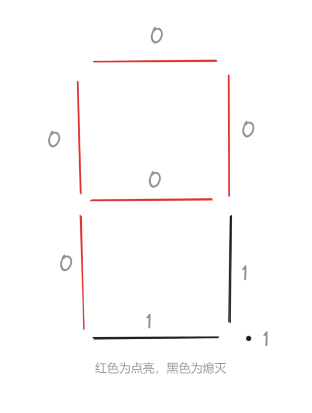</center>

写成二进制就是 `10001100`，对应十六进制 `0x8c`。

---
### 4. 多界面

<center></center>
<center>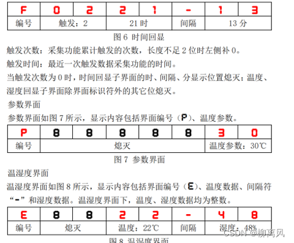</center>

```c
多界面需要定义显示状态码，根据题目分为三个主界面，其中一个主界面分为三个子界面
所以定义一个state_display1,定义一个state_display2

// 定义状态码
uchar state_display1, state_display2;

// 根据状态码切换显示内容
switch (state_display1) 
{
    case 0:
        break;
    case 1:
		switch (state_display2) 
		{
		    case 0:
		        break;
		    case 1:
		        break;
		    case 2:
		        break;
		    default:
		        break;
		}
        break;
    case 2:
        break;
    default:
        break;
}
```
---
### 5. 数码管闪烁

有两种写法：

1. 用DS1302的秒控制（只能以秒为单位闪烁，并且题目使用了DS1302，否则0分）。
    
2. 用定时器中断产生标志位。
    
```c
// DS1302写法为例
SMG[0] = Time[2] / 16;
SMG[1] = Time[2] % 16;
SMG[2] = (Time[0] % 2) ? 17 : 16; // 16为-的索引、17为熄灭索引
SMG[3] = Time[1] / 16;
SMG[4] = Time[1] % 16;
SMG[5] = (Time[0] % 2) ? 17 : 16; // 16为-的索引、17为熄灭索引
SMG[6] = Time[0] / 16;
SMG[7] = Time[0] % 16;
```

```c
// 定时器中断标志为例
void timer1() interrupt 3 {
    if (++count_1000ms == 1000) {
        count_1000ms = 0;
        flag_flash ^= 1;
    }
    systick_ms++;
    key_dly++;
    display_dly++;
    collect_dly++;
    smg(SMG, dot, pos);
    led(LED, pos);
    if (++pos == 8) pos = 0;
}
SMG[0] = Time[2] / 16;
SMG[1] = Time[2] % 16;
SMG[2] = (flag_flash) ? 17 : 16; // 16为-的索引、17为熄灭索引
SMG[3] = Time[1] / 16;
SMG[4] = Time[1] % 16;
SMG[5] = (flag_flash) ? 17 : 16; // 16为-的索引、17为熄灭索引
SMG[6] = Time[0] / 16;
SMG[7] = Time[0] % 16;
```
---
### 6. 高位熄灭

以频率测量为例：
```c
SMG[0] = 17;
SMG[1] = 17;
SMG[2] = 17;
SMG[3] = (fre < 10000) ? 17 : fre / 10000;
SMG[4] = (fre < 1000) ? 17 : fre / 1000 % 10;
SMG[5] = (fre < 100) ? 17 : fre / 100 % 10;
SMG[6] = (fre < 10) ? 17 : fre / 10 % 10;
SMG[7] = fre % 10;
```
---
### 7. 负数显示

<center></center>

以第十四届国赛为例：
```c
char par = -100; // 因为题目同时考到了负数显示及高位熄灭，只能按正负分类讨论，否则嵌套逻辑太复杂
if (par >= 0) { // 大于0需要高位熄灭
    SMG[5] = (par < 100) ? 17 : par / 100;
    SMG[6] = (par < 10) ? 17 : par / 10 % 10;
    SMG[7] = par % 10;
} else if (par < 0) {
    SMG[5] = (par < -10) ? 16 : 17; // 17为熄灭索引，16为-索引
    SMG[6] = (par > -10) ? 16 : (-par) / 10;
    SMG[7] = (-par) % 10;
}
```
---
### 8. 单位切换

<center>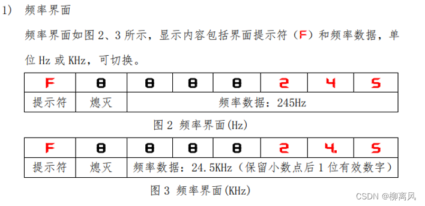</center>

以第十三届国赛为例：
```c
// 假设频率为245HZ，那么切换后为0.2KHZ，切换后发现数码管带小数的这位高位不熄灭
unsigned long fre; // 显示六位，已经大于65535了，不能用uint
unsigned long fre_khz;
if (mode_fre) { // 单位HZ
    SMG[0] = 15; // F
    SMG[1] = 17;
    SMG[2] = (fre < 100000) ? 17 : fre / 100000;
    SMG[3] = (fre < 10000) ? 17 : fre / 10000 % 10;
    SMG[4] = (fre < 1000) ? 17 : fre / 1000 % 10;
    SMG[5] = (fre < 100) ? 17 : fre / 100 % 10;
    SMG[6] = (fre < 10) ? 17 : fre / 10 % 10;
    SMG[7] = fre % 10;
    dot[6] = 0;
} else { // 单位KHZ
    fre_khz = (fre / 1000.0) * 10; // 保留几位小数就×10的几次方
    SMG[0] = 15; // F
    SMG[1] = 17;
    SMG[2] = (fre_khz < 100000) ? 17 : fre / 100000;
    SMG[3] = (fre_khz < 10000) ? 17 : fre / 10000 % 10;
    SMG[4] = (fre_khz < 1000) ? 17 : fre / 1000 % 10;
    SMG[5] = (fre_khz < 100) ? 17 : fre / 100 % 10;
    SMG[6] = fre_khz / 10 % 10; // 高位不熄灭
    SMG[7] = fre_khz % 10;
    dot[6] = 1;
}
```
<center>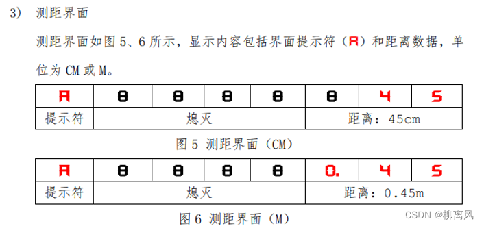</center>

简单分析一下会发现单位为m时只是最高位多了个0，并且小数点位置不变，所以单位为m时高位不熄灭
```c
uchar distance;
if(mode_distance)//单位cm
{
	SMG[0] = 10; //A 
	SMG[1] = 17;
	SMG[2] = 17;
	SMG[3] = 17;
	SMG[4] = 17;
	SMG[5] = (distance < 100) ? 17 :distance/100;
	SMG[6] = (distance < 10) ? 17 :distance/10%10;
	SMG[7] = distance%10;
	dot[5] = 0;
}
else//单位m
{
	SMG[0] = 10; //A 
	SMG[1] = 17;
	SMG[2] = 17;
	SMG[3] = 17;
	SMG[4] = 17;
	SMG[5] = distance/100;//带小数点高位不熄灭
	SMG[6] = distance/10%10;
	SMG[7] = distance%10;
	dot[5] = 1;
}
```
十二届省赛第二场
<center></center>

```c
unsigned long fre; //七位已经大于65535了，不能用uint
unsigned long T;
if(mode_fre)//显示频率
{
	SMG[0] = 15; //F 
	SMG[1] = (fre < 1000000) ? 17 :fre/1000000;;
	SMG[2] = (fre < 100000) ? 17 :fre/100000%10;
	SMG[3] = (fre < 10000) ? 17 :fre/10000%10;
	SMG[4] = (fre < 1000) ? 17 :fre/1000%10;
	SMG[5] = (fre < 100) ? 17 :fre/100%10;
	SMG[6] = (fre < 10) ? 17 :fre/10%10;
	SMG[7] = fre%10;
}
else//显示周期 T= 1/F,注意单位是us;要×10的6次
{
	T=(1.0/fre) *1000000;//因为要保留小数所以1要变成1.0
	SMG[0] = 18; //n
	SMG[1] = (T < 1000000) ? 17 :T/1000000;;
	SMG[2] = (T < 100000) ? 17 :T/100000%10;
	SMG[3] = (T < 10000) ? 17 :T/10000%10;
	SMG[4] = (T < 1000) ? 17 :T/1000%10;
	SMG[5] = (T < 100) ? 17 :T/100%10;
	SMG[6] = (T < 10) ? 17 :T/10%10;
	SMG[7] = T%10;
}
```
---
<div style="page-break-after: always;"></div>

# 二、LED相关考点总结

---
## （一）LED控制代码

LED底层代码一共有两种，一种为状态控制版本，一种为直接赋值法，前者适合状态控制，可以实现每个灯互不影响，后者适合流水灯，PWM灯。
```c
// 状态控制版本
void led(uchar * LED, uchar pos) {
    static uchar temp = 0xff;
    if (LED[pos]) {
        temp &= ~(0x01 << pos);
    } else {
        temp |= 0x01 << pos;
    }
    P0 = temp;
    hc573(4);
}
LED[0] = (col_flag == 0 && display_state1 == 0) ? 1 : 0;
LED[1] = (col_flag == 0 && display_state1 == 1) ? 1 : 0;
LED[2] = (col_flag == 1) ? 1 : 0;
LED[3] = (count_tri > 0 && temp > temp_par) ? L4_state : 0;
LED[4] = (count_tri > 0 && (hum > 90 || hum < 10)) ? 1 : 0;
LED[5] = (count_tri >= 2) ? L6_state : 0;
LED[6] = 0;
LED[7] = 0;
```

```c
// 直接赋值法
void timer1() interrupt 3 {
    systick_ms++;
    key_dly++;
    display_dly++;
    collect_dly++;
    smg(SMG, dot, pos);
    if (++count_200ms == 200) {
        count_200ms = 0;
        P0 = 0xff << position;  // 整体赋值
        hc573(4);
        if (++position == 9) position = 0;
    }
    if (++pos == 8) pos = 0;
    relay(state_relay);
}
```
<div style="page-break-after: always;"></div>

## （二）LED考点分析

---
### 1. 流水灯

以第二届省赛为例：
<center></center>

```c
void timer1() interrupt 3 {
    systick_ms++;
    key_dly++;
    display_dly++;
    collect_dly++;
    smg(SMG, dot, pos);
    if (++count_200ms == 200) {
        count_200ms = 0;
        P0 = 0xff << position;  // 整体赋值
        hc573(4);
        if (mode) {
            if (++position == 9) position = 0;
        } else {
            if (position > 0) position--;
            else position = 8;
        }
    }
    if (++pos == 8) pos = 0;
    relay(state_relay);
}
```

---
### 2. PWM流水灯

以第九届省赛为例：
<center>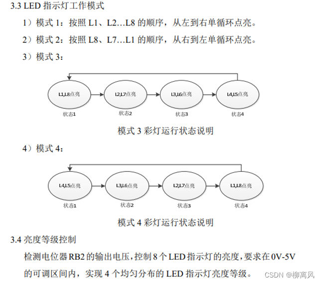</center>
ledpwm调光的频率大概在100HZ左右，对应时间10ms，题目要求分四个PWM占空比，25%，50%，75%，100%，这样的话需要在2.5ms改变一次LED状态，有点不合理，所以我们将周期改为12ms,频率83HZ。  
需要注意的是LED低电平点亮  
下面以实现25%亮度为例
<center></center>

```c
uint count_ms;
uint mode_time;
void timer1() interrupt 3 {
    systick_ms++;
    key_dly++;
    display_dly++;
    collect_dly++;
    smg(SMG, dot, pos);
    if (++count_ms == mode_time) {  // 控制移位
        count_ms = 0;
        if (++position == 9) position = 0;
    }
    if (pwm_count == 0) {  // 等于0点亮LED
        P0 = 0xff << position;  // 整体赋值
        hc573(4);
    } else if (pwm_count == pwm_duty) {  // 等于占空比时熄灭
        P0 = 0xff;  // 整体赋值
        hc573(4);
    }
    if (++pwm_count == 12) {  // 加到12归零
        pwm_count = 0;
    }
    if (++pos == 8) pos = 0;
    relay(state_relay);
}
```

---
### 3. LED闪烁（以x秒为间隔闪烁指的是亮和灭的时间间隔）

#### 题目一

<center>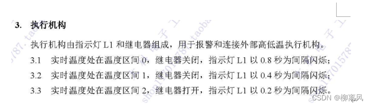</center>

```c
uint count_ms;
uint mode_time;
void timer1() interrupt 3 {
    systick_ms++;
    key_dly++;
    display_dly++;
    collect_dly++;
    smg(SMG, dot, pos);
    if (++count_ms == mode_time) {
        count_ms = 0;
        L1_flag ^= 1;//每隔一段时间取反
    }
    if (++pos == 8) pos = 0;
    relay(state_relay);
}
LED[0] = L1_flag;
LED[1] = 0;
LED[2] = 0;
LED[3] = 0;
LED[4] = 0;
LED[5] = 0;
LED[6] = 0;
LED[7] = 0;
```

#### 题目二

<center></center>

```c
uint count_ms;
void timer1() interrupt 3 {
    systick_ms++;
    key_dly++;
    display_dly++;
    collect_dly++;
    smg(SMG, dot, pos);
    if (++count_ms == 100) {
        count_ms = 0;
        L8_flag ^= 1;//每隔100ms取反
    }
    if (++pos == 8) pos = 0;
    relay(state_relay);
}
LED[0] = 0;
LED[1] = 0;
LED[2] = 0;
LED[3] = 0;
LED[4] = 0;
LED[5] = 0;
LED[6] = 0;
LED[7] = (mode) ? L8_flag : 0;//仅在指定模式下闪烁
```

---
### 4. LED亮一定时间后熄灭

#### 题目一

<center>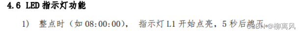</center>

```c
LED[0] = (Time[1] == 0 && (Time[0] >= 0 && Time[0] < 5)) ? 1 : 0;//使用ds1302实现
LED[1] = 0;
LED[2] = 0;
LED[3] = 0;
LED[4] = 0;
LED[5] = 0;
LED[6] = 0;
LED[7] = 0;
```

#### 题目二

<center></center>

```c
uint count_ms;
uchar count;
void timer1() interrupt 3 {
    systick_ms++;
    key_dly++;
    display_dly++;
    collect_dly++;
    smg(SMG, dot, pos);
    if (state == 1) {
        if (++count_ms == 200) {
            count_ms = 0;
            if (++count == 20) {  // 亮灭各十次
                count = 0;
                state = 0;
            }
        }
    }
    if (++pos == 8) pos = 0;
    relay(state_relay);
}
LED[0] = (state == 1) ? count % 2 : 0;
LED[1] = 0;
LED[2] = 0;
LED[3] = 0;
LED[4] = 0;
LED[5] = 0;
LED[6] = 0;
LED[7] = 0;
```

---
### 5. 状态指示灯

<center>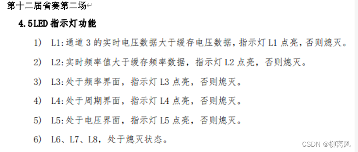</center>

```c
LED[0] = (vol > vol_old) ? 1 : 0;
LED[1] = (fre > fre_old) ? 1 : 0;
LED[2] = (state_display == 0) ? 1 : 0;
LED[3] = (state_display == 1) ? 1 : 0;
LED[4] = (state_display == 2) ? 1 : 0;
LED[5] = 0;
LED[6] = 0;
LED[7] = 0;
```

---
### 6. 二进制灯

<center>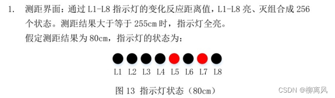</center>

<center>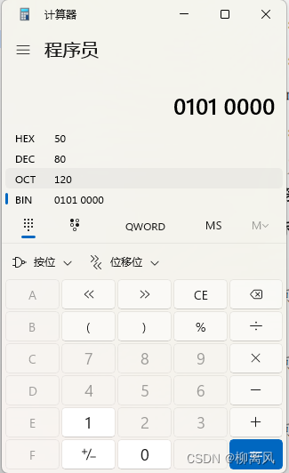</center>

用程序员计算器计算发现80的二进制为01010000；与LED的显示正好相反，所以需要进行取反

```c
void timer1() interrupt 3 {
    systick_ms++;
    key_dly++;
    display_dly++;
    collect_dly++;
    smg(SMG, dot, pos);
    P0 = ~(distance);//~（01010000）
    hc573(4);
    if (++pos == 8) pos = 0;
    relay(state_relay);
}
```
---
<div style="page-break-after: always;"></div>

# 三、按键考点总结

---
## （一）按键底层代码

按键底层一共有两种：独立按键和矩阵键盘。（这里按键消抖使用定时器任务调度来实现）

```c
bit key_up = 1;

// 独立按键
uchar key_scan1()
{
    if (key_up == 1 && (P30 == 0 || P31 == 0 || P32 == 0 || P33 == 0))
    {
        key_up = 0;
        if (P30 == 0) return 1;
        else if (P31 == 0) return 2;
        else if (P32 == 0) return 3;
        else if (P33 == 0) return 4;
    }
    else if (P30 == 1 && P31 == 1 && P32 == 1 && P33 == 1)
        key_up = 1;
    return 0;
}
```

```c
// 矩阵键盘
uchar key_scan2()
{
    uchar key;
    P44 = P42 = P35 = P34 = 1;
    P30 = P31 = P32 = P33 = 0;
    if (key_up == 1 && (P44 == 0 || P42 == 0 || P35 == 0 || P34 == 0))
    {
        if (P44 == 0) key = 1;
        else if (P42 == 0) key = 2;
        else if (P35 == 0) key = 3;
        else if (P34 == 0) key = 4;
        else return 0;
        P44 = P42 = P35 = P34 = 0;
        P30 = P31 = P32 = P33 = 1;
        key_up = 0;
        if (P30 == 0) key = key;
        else if (P31 == 0) key = key + 4;
        else if (P32 == 0) key = key + 8;
        else if (P33 == 0) key = key + 12;
        return key;
    }
    else if (P44 == 1 && P42 == 1 && P35 == 1 && P34 == 1)
        key_up = 1;
    return 0;
}
```

```c
// 主函数中的按键处理任务
void key_task()
{
    uchar key;
    if (key_dly < 10) return;
    key_dly = 0;
    key = key_scan2();
    switch (key)
    {
        case 1: // S5
            break;
        case 2: // S9
            break;
        case 3: // S4
            break;
        case 4: // S8
            break;
    }
}
```
<div style="page-break-after: always;"></div>

## (二)按键触发方式（近几年 S4、S5、S8、S9 考频很高，就以这四个按键为例）

---
### 1. 按下生效、松手生效

第八届省赛
<center>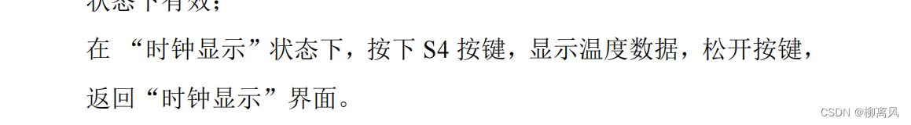</center>

```c
uchar key_scan2()
{
    static bit S4_flag;
    uchar key;
    P44 = P42 = 1;
    P32 = P33 = 0;
    if (key_up == 1 && (P44 == 0 || P42 == 0))
    {
        if (P44 == 0) key = 1;
        else if (P42 == 0) key = 2;
        else return 0;
        P44 = P42 = 0;
        P32 = P33 = 1;
        key_up = 0;
        if (P32 == 0) key = key;
        else if (P33 == 0) key = key + 2;
        if (key == 3) // S4 按下
            S4_flag = 1;
        return key; // S4 按下后返回 3
    }
    else if (P44 == 1 && P42 == 1)
    {
        key_up = 1;
        if (S4_flag == 1)
        {
            S4_flag = 0;
            return 40;  // S4 按下后的松手
        }
    }
    return 0;
}

// 主函数中的按键处理任务
void key_task()
{
    uchar key;
    if (key_dly < 10) return;
    key_dly = 0;
    key = key_scan2();
    switch (key)
    {
        case 1: // S5
            break;
        case 2: // S9
            break;
        case 3: // S4 按下
            break;
        case 4: // S8
            break;
        case 40: // S4 按下后松手
            break;
    }
}
```
